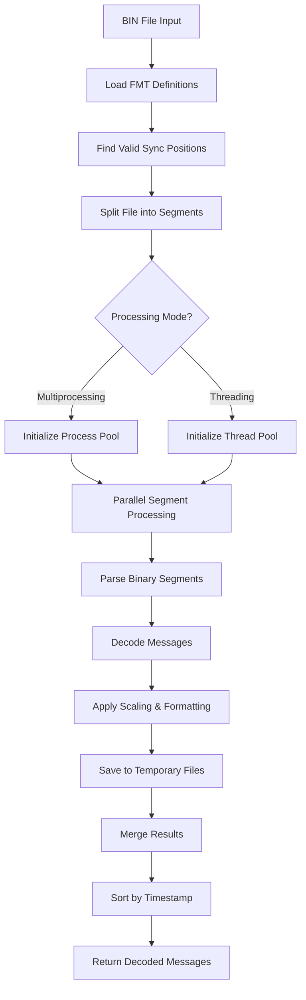

# ArduPilot BIN Log Parser

A high-performance, parallel Python parser for ArduPilot binary log files (.BIN format). This project provides efficient decoding of flight telemetry data with support for both multiprocessing and multithreading execution modes.

##  Project Purpose

This parser is designed to efficiently extract and decode telemetry data from ArduPilot flight controller binary logs. It offers significant performance improvements over traditional sequential parsing methods by leveraging parallel processing capabilities. The parser is particularly useful for:

- Processing large flight log files (100MB+)
- Real-time data analysis pipelines
- Batch processing of multiple log files
- Integration into larger flight analysis systems

##  Code Strengths

### 1. **Parallel Processing Architecture**
- Supports both multiprocessing and multithreading modes
- Automatic workload distribution across available CPU cores
- Intelligent file segmentation based on sync markers
- Zero data loss with proper boundary handling

### 2. **Memory Efficiency**
- Memory-mapped file access (mmap) for large files
- Streaming parser design with generator patterns
- Temporary file serialization for intermediate results
- Minimal memory footprint even with GB-sized logs

### 3. **Robust Error Handling**
- Graceful handling of corrupted data segments
- Warning collection system for debugging
- Automatic recovery from partial message corruption
- Comprehensive logging infrastructure

### 4. **Performance Optimizations**
- Struct unpacking cache for repeated operations
- Pre-compiled format definitions
- Configurable float rounding for space savings
- Message type filtering at parse time

### 5. **Clean Architecture**
- Separation of concerns (parser, controller, utilities)
- Configurable via JSON configuration
- Comprehensive test coverage
- Type hints throughout the codebase

## 📁 Project Structure

```
ardupilot-bin-parser/
│
├── src/
│   ├── main.py                        # Entry point for the application
│   │
│   ├── bussines_logic/
│   │   ├── bin_log_parser.py          # Core binary parsing logic
│   │   └── controller.py              # Parallel processing orchestration
│   │
│   └── utils/
│       ├── config_loader.py           # Configuration management
│       ├── log_config.py              # Logging setup
│       ├── utils.py                   # Helper functions
│       └── benchmark_decoders.py      # Performance benchmarking tools
│
├── tests/
│   ├── conftest.py                    # pytest fixtures and test utilities
│   ├── test_bin_log_parser_unit.py    # Unit tests for parser
│   ├── test_parallel_decoder_integration.py  # Integration tests
│   ├── test_helpers_unit.py           # Helper function tests
│   └── test_compare_with_pymavlink.py # Comparison with pymavlink
│
├── config.json                         # Application configuration
├── requirements.txt                    # Python dependencies
└── logs/                              # Log file directory
    ├── app.log                        # Application logs
    └── tests.log                      # Test execution logs
```

##  Main Processing Flow



##  Core Components

### Main Classes

| Class | File | Purpose |
|-------|------|---------|
| `BinLogParser` | `bin_log_parser.py` | Core binary parsing engine with FMT loading and message decoding |
| `ParallelBinDecoder` | `controller.py` | Orchestrates parallel processing across multiple workers |

### Key Functions

| Function | Location | Purpose |
|----------|----------|---------|
| `preload_fmt_messages()` | `BinLogParser` | Scans and loads all FMT message definitions |
| `parse_messages_in_range()` | `BinLogParser` | Generator that yields decoded messages from byte range |
| `find_valid_sync_positions()` | `utils.py` | Locates all valid message boundaries in the file |
| `split_ranges()` | `utils.py` | Divides file into balanced segments for parallel processing |
| `_worker_process_segment()` | `controller.py` | Worker function for multiprocessing pool |
| `_worker_thread_segment()` | `controller.py` | Worker function for thread pool |
| `extract_field_names()` | `utils.py` | Parses field names from FMT definitions |
| `convert_to_struct_format()` | `utils.py` | Converts ArduPilot format to Python struct format |

##  Usage

### Basic Usage

```python
from src.bussines_logic.controller import ParallelBinDecoder

# Initialize decoder
decoder = ParallelBinDecoder(
    file_path="flight_log.bin",
    num_workers=8,              # Number of parallel workers
    round_floats=True,           # Round floating point values
    running_mode="process",      # "process" or "thread"
    message_filter={"GPS", "IMU"} # Optional: filter specific message types
)

# Run decoding
messages = decoder.run()

# Process results
for message in messages:
    print(f"Type: {message['message_type']}, Time: {message['TimeUS']}")
```

### Advanced Configuration

```python
# Direct parser usage for sequential processing
from src.bussines_logic.bin_log_parser import BinLogParser
import mmap

with open("flight_log.bin", "rb") as f:
    mapped_file = mmap.mmap(f.fileno(), 0, access=mmap.ACCESS_READ)
    parser = BinLogParser(
        mapped_file,
        round_floats=True,
        collect_warnings=True
    )
    
    parser.preload_fmt_messages()
    
    for message in parser.parse_messages_in_range(0, 1000000):
        # Process each message
        pass
```

## 📊 Performance Benchmarks

The project includes a comprehensive benchmarking tool (`benchmark_decoders.py`) that compares:

- Multiprocessing mode performance
- Threading mode performance  
- pymavlink baseline comparison
- Memory usage patterns
- Scaling with different worker counts

Typical performance improvements:
- **4-7x faster** than pymavlink for large files ,defence on running mode
- **Linear scaling** up to CPU core count
- **50% memory reduction** with streaming mode


##  Future Development Opportunities

### Feature Additions
- [ ] Real-time streaming parser mode
- [ ] Web API interface
- [ ] Export to multiple formats (CSV, Parquet, HDF5)
- [ ] Message integrity verification
- [ ] Automatic log repair capabilities
- [ ] GUI for visual log inspection

### Data Analysis
- [ ] Built-in flight analysis algorithms
- [ ] Anomaly detection in telemetry data
- [ ] Automatic report generation
- [ ] Integration with popular visualization tools


## 📦 Installation

```bash
# Clone the repository
git clone https://github.com/yourusername/ardupilot-bin-parser.git
cd ardupilot-bin-parser

# Install dependencies
pip install -r requirements.txt

# Run tests
pytest tests/

# Run benchmarks
python src/utils/benchmark_decoders.py your_log_file.bin
```


##  Benchmarking

Compare performance across different modes:

```bash
python src/utils/benchmark_decoders.py flight_log.bin --workers 8
```


